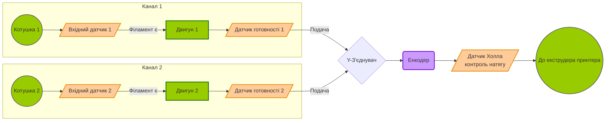

# Архітектура автолодера філаменту

## Загальний опис роботи
Автолодер призначений для автоматичної безперервної подачі філаменту на 3D-принтер з двох котушок. Основна його функція: коли на одній котушці закінчується філамент, система автоматично перемикається на іншу за умови, що вона заправлена і готова. Для синхронізації подачі між автолодером та екструдером принтера використовується комбінація енкодера та датчика Холла.

## Апаратна конфігурація
- **Вхідні датчики (2 шт.):** Розташовані на вході з котушок. Сигналізують контролеру про наявність філаменту або про його закінчення (runout).
- **Подаючі механізми з двигунами (2 шт.):** Контрольовані двигуни, які протягують філамент по своїх каналах.
- **Датчики готовності (2 шт.):** Розташовані безпосередньо після двигунів. Їхня задача — підтвердити, що філамент успішно завантажений в механізм подачі і знаходиться в стані готовності (standby) для подачі в загальний тракт.
- **Енкодер (1 шт.):** Встановлений на виході після злиття обох каналів (після Y-з'єднувача). Замінює звичайний вихідний датчик. Використовується для вимірювання пройденої відстані, автоматичного калібрування довжини хвостика (від автолодера до екструдера принтера) та контролю швидкості подачі.
- **Датчик Холла (1 шт.):** Встановлений безпосередньо після Енкодера. Використовується для контролю натягу (або упирання) філаменту. Дані з цього датчика дозволяють синхронізувати подачу та підтримувати необхідний рівень натягу між автолодером і принтером.

---

## Векторна кінематична схема (Mermaid)

Нижче наведено логічну схему проходження філаменту через всі вузли автолодера.

---

## Алгоритм зміни філаменту та синхронізації (Логіка роботи)

1. **Закінчення поточного філаменту:** Автолодер очікує, поки хвіст поточного філаменту не покине датчик поточного каналу (просигналізувавши, що філамент вийшов).
2. **Вихід філаменту з автолодера:** Після цього система чекає *конфігурований час*, поки **Енкодер** не підтвердить, що хвіст філаменту повністю вийшов з автолодера.
3. **Швидка подача нового філаменту:** Двигун включить подачу нового філаменту на *максимальній швидкості*. Процес триває, доки не спрацює **Датчик Холла**, засвідчивши, що виник натяг/упирання філаменту.
4. **Каліброване протягування:** Після спрацювання датчика Холла автолодер продовжує подачу, жорстко підтримуючи натяг за допомогою зворотного зв'язку від датчика Холла. Філамент проштовхується на *калібровану відстань*, яка точно вимірюється **Енкодером**.
5. **Перехоплення принтером:** Пройшовши калібровану відстань, автолодер перестає активно штовхати філамент і переходить у режим очікування: система слідкує, коли 3D-принтер сам захопить новий філамент і почне його тягнути (про що засвідчить рух на енкодері).
6. **Синхронізація під час друку:** Після успішного перехоплення філаменту принтером, автолодер переходить у штатний режим роботи і підтримує *мінімальний натяг* філаменту доти, поки нова (тепер вже поточна) котушка теж не закінчиться.

## Налаштування та параметри
- **Пам'ять дистанції (Калібрування):** Відстань від автолодера до екструдера калібрується і зберігається під час першого запуску пристрою або примусово — після довгого затиснення відповідної кнопки керування.
- **Логічні рівні датчиків:** За замовчуванням наявність філаменту відповідає високому логічному рівню (`HIGH`). Цей параметр є конфігурованим у прошивці і може бути змінений залежно від типу застосовуваних датчиків.
