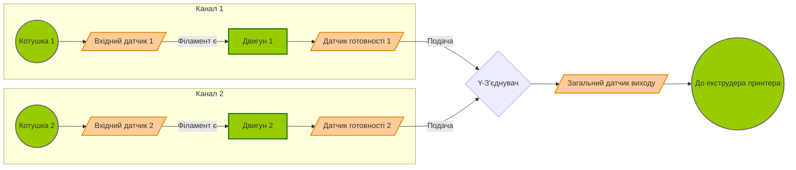

# Архітектура автолодера філаменту

## Загальний опис роботи
Автолодер призначений для автоматичної безперервної подачі філаменту на 3D-принтер з двох котушок. Основна його функція: коли на одній котушці закінчується філамент, система автоматично перемикається на іншу за умови, що вона заправлена і готова.

## Апаратна конфігурація
- **Вхідні датчики (2 шт.):** Розташовані на вході з котушок. Сигналізують контролеру про наявність філаменту або про його закінчення (runout).
- **Подаючі механізми з двигунами (2 шт.):** Контрольовані двигуни, які протягують філамент по своїх каналах.
- **Датчики готовності (2 шт.):** Розташовані безпосередньо після двигунів. Їхня задача — підтвердити, що філамент успішно завантажений в механізм подачі і знаходиться в стані готовності (standby) для подачі в загальний тракт, коли звільниться канал.
- **Загальний вихідний датчик (1 шт.):** Розташований на виході після злиття обох каналів. Контролює фактичний вихід філаменту з автолодера в сторону 3D-принтера.

---

## Векторна кінематична схема (Mermaid)

Нижче наведено логічну схему проходження філаменту через всі вузли автолодера.

---

## Уточнюючі запитання щодо логіки та підключення

Для правильної реалізації програмного коду, у мене є кілька уточнюючих запитань з приводу механіки та логіки роботи:

1. **Реверс (Відкат):** Коли на активному каналі закінчується філамент (спрацьовує `Вхідний датчик`), але попередній шматок все ще знаходиться в тракті (від датчика до екструдера) — чи має автолодер чекати, поки екструдер принтера повністю додрукує і "висмокче" залишок, перш ніж подавати резервний канал?
2. **Y-з'єднувач:** Яка відстань (приблизно) від `Датчиків готовності` до спільного `Y-з'єднувача`? Чи робиться відкат філаменту чергового каналу назад, щоб звільнити шлях в Y-з'єднувачі для іншого каналу?
3. **Функція загального датчика виходу:** Чи використовується він для підрахунку кроків/відстані протягування, або виключно як логічний прапорець (є філамент / немає) факту успішної вигрузки з автолодера?
4. **Активні рівні датчиків:** Датчики спрацьовують на замикання на GND (PULLUP) чи на живлення, і який рівень означає наявність філаменту?
