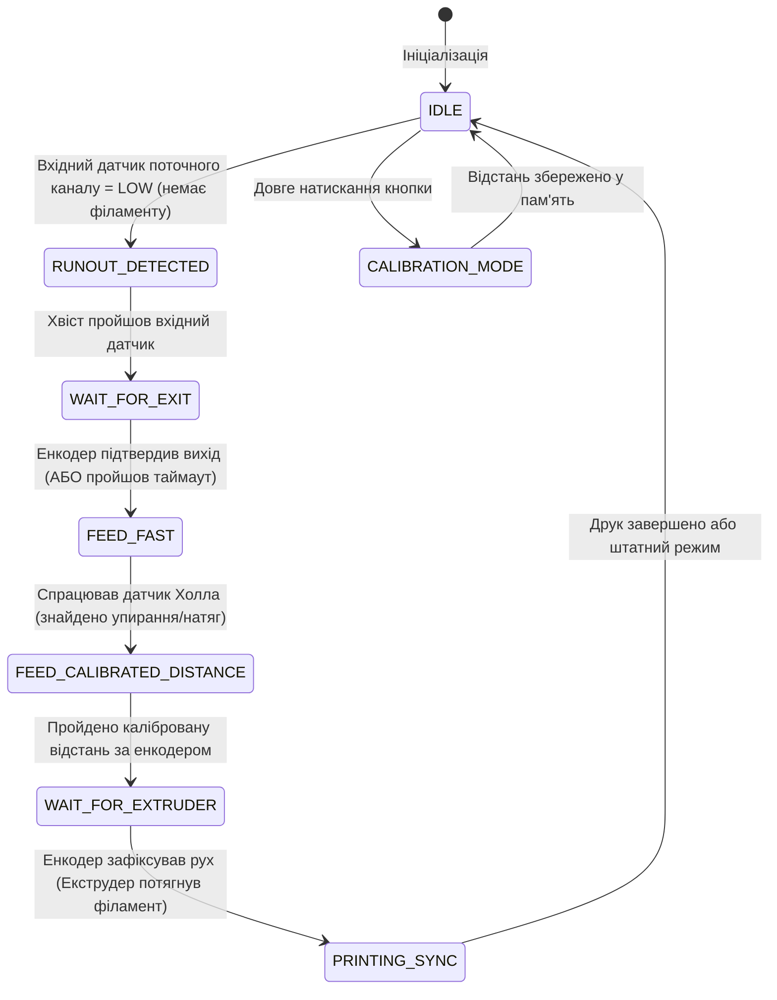

# Кінцевий автомат автолодера (State Machine)

Цей документ описує логічний кінцевий автомат (Finite State Machine, FSM), який керує подачею філаменту та перемиканням каналів у прошивці автолодера.

## Діаграма станів (Mermaid)

---

## Детальний опис станів

### 1. `IDLE` (Режим очікування / Штатна робота)
- **Опис:** Основний робочий стан. Автолодер просто спостерігає за датчиками. Принтер або не друкує, або друкує без проблем.
- **Двигуни:** Вимкнені або в режимі утримання мінімального натягу (якщо це передбачено механікою).
- **Умова переходу:** Якщо `Вхідний датчик` поточного активного каналу фіксує відсутність філаменту — перехід у стан `RUNOUT_DETECTED`. Якщо користувач затиснув кнопку — `CALIBRATION_MODE`.

### 2. `RUNOUT_DETECTED` (Виявлено закінчення)
- **Опис:** Котушка спорожніла. Система знає, що почався процес "runout", але кінець філаменту ще знаходиться в тракті автолодера.
- **Двигуни:** Поточний канал продовжує працювати в синхронізованому режимі з принтером, віддаючи залишки філаменту.
- **Умова переходу:** Чекаємо, поки хвіст філаменту залишить поточний Вхідний датчик і пройде далі. Перехід у `WAIT_FOR_EXIT`.

### 3. `WAIT_FOR_EXIT` (Очікування виходу хвоста)
- **Опис:** Автолодер очікує, поки залишок (хвіст) старого філаменту повністю покине механізм подачі та вийде за межі автолодера, щоб звільнити шлях для нового.
- **Двигуни:** Зупинені.
- **Умова переходу:** Система відслідковує показання **Енкодера**. Коли енкодер відміряє необхідну дистанцію або пройде конфігурований час таймауту (що гарантує вихід філаменту) — перехід у стан `FEED_FAST`.

### 4. `FEED_FAST` (Швидка подача нового філаменту)
- **Опис:** Шлях вільний. Автолодер починає швидко заганяти філамент з резервного (нового) каналу в трубку Боудена в сторону екструдера принтера.
- **Двигуни:** Двигун нового каналу вмикається на **максимальну швидкість**.
- **Умова переходу:** Подача триває доти, доки філамент не дійде до екструдера або вузького місця і не створить опір/натяг. Це фіксується **Датчиком Холла**. При його спрацюванні — перехід у `FEED_CALIBRATED_DISTANCE`.

### 5. `FEED_CALIBRATED_DISTANCE` (Каліброване протягування)
- **Опис:** Філамент дійшов до друкуючої голови. Тепер автолодер має обережно доштовхнути його безпосередньо в шестерні екструдера.
- **Двигуни:** Двигун продовжує подачу з контролем натягу. Використовується зворотний зв'язок від датчика Холла (PID-регулятор або просте обмеження струму/швидкості), щоб не перетиснути.
- **Умова переходу:** Енкодер відраховує пройдений шлях. Коли філамент проходить заздалегідь **калібровану відстань**, двигун зупиняє агресивне проштовхування — перехід у `WAIT_FOR_EXTRUDER`.

### 6. `WAIT_FOR_EXTRUDER` (Очікування захоплення принтером)
- **Опис:** Філамент подано в зону захвату шестерень екструдера принтера. Автолодер перестає активно штовхати. 
- **Двигуни:** Двигун зупинено, але може залишатися у легкому тонусі (standby).
- **Умова переходу:** Автолодер аналізує показання **Енкодера**. Як тільки екструдер принтера захопить філамент і почне його самостійно тягнути (енкодер покаже рух вперед) — перехід у стан `PRINTING_SYNC`.

### 7. `PRINTING_SYNC` (Синхронізований друк)
- **Опис:** Принтер успішно захопив резервний філамент. Заміна завершена. Автолодер переходить у режим підтримання балансу натягу, щоб не створювати зайвого опору екструдеру.
- **Двигуни:** Працюють адаптивно, підтримуючи "мінімальний натяг" або нульовий опір, орієнтуючись на датчик Холла та енкодер. Поточний керуючий канал змінюється на новий.
- **Умова переходу:** Після завершення перехідного режиму система повертається у звичайний `IDLE` (або просто залишається в цьому стані, який є аналогом штатної роботи).

---

## Режим калібрування (CALIBRATION_MODE)
- **Опис:** Спеціальний стан, який викликається або автоматично при першому включенні (якщо дані в EEPROM/NVS порожні), або вручну через довге натискання кнопки.
- **Дія:** Оператор або сам автолодер в напівавтоматичному режимі проганяє філамент від датчика Холла до точки захвату екструдером. Енкодер рахує кількість імпульсів (відстань). 
- **Завершення:** Після завершення операції, виміряна дистанція записується в енергонезалежну пам'ять (Flash) і слугуватиме еталоном для стану `FEED_CALIBRATED_DISTANCE`. Система повертається в `IDLE`.
